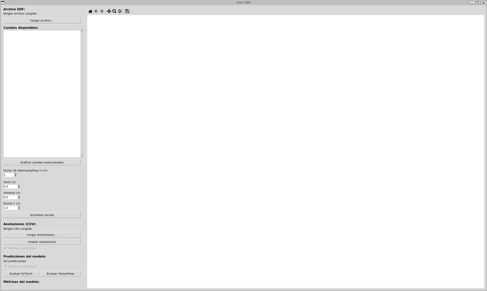

# Visor de canales EDF

Aplicación de escritorio simple para visualizar señales EEG almacenadas en archivos EDF.

Este repositorio contiene `ui.py`, una interfaz gráfica basada en Tkinter con Matplotlib embebido que permite:

- Cargar archivos `.edf` y listar sus canales.
- Seleccionar múltiples canales y graficarlos con opciones de downsampling y zoom.
- Cargar anotaciones en CSV y resaltar intervalos de convulsión (label `seiz`).
- Enviar el EDF (y opcionalmente el CSV) a un servicio de inferencia para obtener predicciones y métricas.

## Contenido

- `ui.py`: código fuente de la interfaz gráfica.
- `requirements.txt`: dependencias Python.
- `tests/`: pruebas unitarias (pytest).

## Requisitos

- Python 3.10 o superior.
- Paquetes Python listados en `requirements.txt`.
- En Linux, asegúrate de tener las bibliotecas de desarrollo y Tk disponibles. En Debian/Ubuntu suele bastar con:

```bash
sudo apt update
sudo apt install -y python3-venv python3-tk build-essential
```

Nota: `pyEDFlib` puede requerir compilación de extensiones nativas en algunas plataformas. Si su instalación falla, instala las herramientas de compilación de tu distribución (por ejemplo `build-essential`) y vuelve a intentar.

### Requisitos en Windows

- Instala Python 3.10+ desde python.org (asegúrate de marcar "Add Python to PATH").
- Tkinter suele incluirse con la instalación oficial de Python en Windows. Si falta, reinstala Python usando el instalador oficial.
- Si `pyEDFlib` necesita compilar extensiones nativas en Windows, instala "Build Tools for Visual Studio" (Visual C++ build tools). Puedes obtenerlos desde https://visualstudio.microsoft.com/visual-cpp-build-tools/.

## Instalación rápida

1. Crear y activar un entorno virtual (recomendado):

Linux / macOS (bash, zsh):

```bash
python -m venv .venv
source .venv/bin/activate
```

Windows (PowerShell):

```powershell
python -m venv .venv
.venv\Scripts\Activate
```

Si PowerShell bloquea la ejecución de scripts, puedes permitir temporalmente la ejecución en la sesión actual y luego activar:

```powershell
Set-ExecutionPolicy -ExecutionPolicy RemoteSigned -Scope Process -Force
.venv\Scripts\Activate
```

Windows (Command Prompt - cmd.exe):

```cmd
python -m venv .venv
.\.venv\Scripts\activate.bat
```

Windows (Git Bash / MSYS):

```bash
python -m venv .venv
source .venv/Scripts/activate
```

Nota: en algunas instalaciones de Windows el comando `python` no está registrado y es necesario usar `py -3` en su lugar. Por ejemplo:

```powershell
py -3 -m venv .venv
.\.venv\Scripts\Activate.ps1
```

2. Instalar dependencias:

```bash
pip install -r requirements.txt
```

Si la instalación de `pyEDFlib` falla, revisa la salida de error: normalmente indica si faltan librerías del sistema o un compilador.

### Pasos recomendados si `pyEDFlib` falla con pip

1. Actualiza herramientas de empaquetado y dependencias esenciales:

```bash
pip install --upgrade pip setuptools wheel cython
pip install numpy
```

2. Intenta instalar `pyEDFlib` de nuevo:

```bash
pip install pyEDFlib
```

3. Si sigue fallando en Linux, instala las dependencias de sistema (Debian/Ubuntu como ejemplo):

```bash
sudo apt install -y build-essential python3-dev
```

En Windows, si la compilación falla, instala las "Build Tools for Visual Studio" y vuelve a intentar.

4. Alternativa fácil: usar conda (evita compilar extensiones en muchas plataformas):

```bash
conda create -n edfviewer python=3.10 -y
conda activate edfviewer
conda install -c conda-forge pyedflib matplotlib numpy -y
pip install -r requirements.txt  # para las dependencias no disponibles en conda
```

Si logras instalar `pyEDFlib` con conda, puedes usar el mismo entorno para ejecutar la aplicación.

## Ejecutar la aplicación

Con el entorno activado, lanza:

```bash
python ui.py
```

La ventana principal mostrará la interfaz gráfica. A continuación se describe cada control y cómo usarlo.

<!-- Placeholder para imagen de la GUI: coloca tu captura en `assets/gui_screenshot.png` o actualiza la ruta -->



> Nota: coloca tu imagen en `assets/gui_screenshot.png` o edita la ruta en este README para que la vista previa muestre la interfaz aquí.

## Guía de la interfaz (panel lateral y área de gráficos)

Controles principales en el panel izquierdo:

- Archivo EDF / `Cargar archivo…`: abre un diálogo para seleccionar un `.edf`. Al cargar, se rellenará la lista de canales.
- Etiqueta de archivo: muestra el nombre del EDF cargado.
- Lista de canales (Listbox): selecciona uno o varios canales (Ctrl+click o Shift+click) para graficar.
- `Graficar canales seleccionados`: dibuja los canales actualmente seleccionados con las opciones elegidas.

Controles de rendimiento / visualización:

- Factor de downsampling (Spinbox): entero >= 1. Extrae cada N-ésima muestra para acelerar la visualización de señales largas.
- Inicio (s): tiempo de inicio en segundos para el recorte temporal visible.
- Ventana (s): duración (en segundos) de la ventana visible; si es 0 o mayor que la duración del EDF, la vista mostrará hasta el final.
- Escala Y (x): multiplica la amplitud centrada de cada canal; útil para ajustar el alto relativo entre canales.
- `Actualizar escala`: aplica las escalas y reaplica (también puedes usar el botón `Graficar channels`).

Anotaciones (CSV):

- `Cargar anotaciones…`: carga un archivo CSV con anotaciones. El formato esperado es el esquema con encabezado `channel,start_time,stop_time,label,confidence` (puede contener comentarios que comienzan con `#`).
- Solo se consideran las filas cuyo `label` sea exactamente `seiz` (insensible a mayúsculas/minúsculas).
- `Limpiar anotaciones`: elimina las anotaciones cargadas.
- `Mostrar anotaciones` (checkbox): activa/desactiva el sombreado de intervalos detectados en el gráfico.

Predicciones del modelo (evaluación remota):

- `Evaluar PyTorch` / `Evaluar TensorFlow`: envían el archivo EDF abierto (y el CSV de anotaciones, si está cargado) a un servicio HTTP para obtener intervalos predichos y métricas.
- El código hace POST a: `http://127.0.0.1:8000/api/models/eval_network_pt` o `.../eval_network_tf` (configurable editando `API_BASE_URL` en `ui.py`).
- Al recibir respuesta, se muestran las predicciones (áreas en azul) y las métricas en el panel lateral.
- `Mostrar predicciones` (checkbox): habilita/deshabilita el sombreado de predicciones.

Área de gráficos (lado derecho):

- Visualiza los canales seleccionados, con offsets verticales para distinguirlos.
- Intervalos `seiz` del CSV aparecen sombreados en rojo; las predicciones del modelo en azul.
- Barra de herramientas de Matplotlib está disponible para hacer zoom/pan básicos.

## Formato de CSV de anotaciones

Se espera un CSV con encabezado (ejemplo):

A continuación se muestra el mismo ejemplo en formato de tabla para facilitar su lectura:

| channel     | start_time (s) | stop_time (s) | label | confidence |
|-------------|----------------:|--------------:|:-----:|-----------:|
| Ref |           12.50 |         25.00 | seiz  |       0.95 |


- Se aceptan líneas de comentario que comiencen con `#` y serán ignoradas.
- Solo se consideran las filas con `label` igual a `seiz` (minúsculas o mayúsculas).

## Servicio de inferencia (endpoints esperados)

La aplicación asume un servicio HTTP local en `http://127.0.0.1:8000/api/models` con dos endpoints:

- `/eval_network_pt`: recibe multipart form-data con `edf_file` (archivo) y opcional `csv_file`. Devuelve JSON con estructura aproximada:

```json
{
"events": [{
        "start_time": 12.5,
        "stop_time": 25.0, 
        "label": "predicted_seizure", 
        "confidence": 0.87
    }],
	"metrics": {
        "precision": 0.9, 
        "recall": 0.8,    
        "f1": 0.85
    },
	"model_type": "pt",
	"model_architecture": "my_net"
}
```

- `/eval_network_tf`: equivalente para modelos TensorFlow.

Si usas otra URL, edita la constante `API_BASE_URL` en `ui.py`.

## Consejos y resolución de problemas

- Si recibes errores relacionados con Tkinter: instala el paquete del sistema correspondiente (`python3-tk` en Debian/Ubuntu).
- Errores al instalar `pyEDFlib`: instala herramientas de compilación y vuelve a intentarlo (`build-essential`, `python3-dev` en distribuciones Debian/Ubuntu).
- Si la aplicación no muestra canales tras cargar el EDF, inspecciona los logs en la terminal donde ejecutaste `python ui.py` para ver excepciones.
- Para visualizar rápidamente archivos grandes: aumenta el `Factor de downsampling` (p. ej. 10 o 50) y reduce la `Ventana (s)`.

